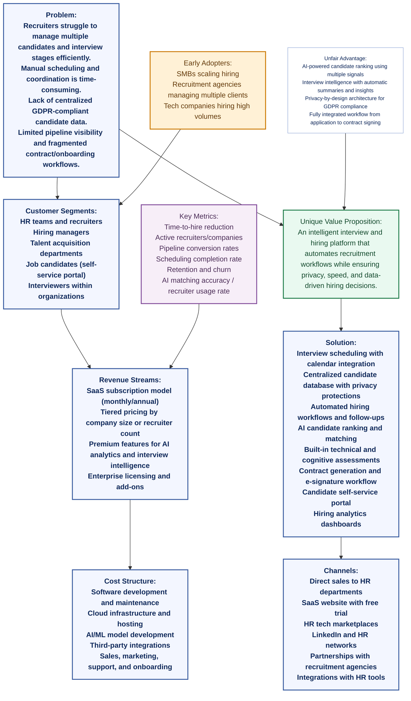

Lean Canvas — LTI (Interview & Hiring ATS)
1. Problem
Recruiters struggle to manage multiple candidates and interview stages efficiently.
Manual scheduling and coordination between candidates and interviewers is time-consuming.
Lack of centralized candidate data with privacy compliance (e.g., GDPR).
Limited visibility into pipeline progress and hiring performance metrics.
Contract generation and onboarding processes are often fragmented across tools.
2. Customer Segments

Primary customers

HR teams and recruiters
Hiring managers
Talent acquisition departments

Secondary users

Job candidates (through the self-service portal)
Interviewers within organizations

Early adopters

Small–medium companies scaling hiring
Recruitment agencies managing multiple clients
Tech companies hiring high volumes of candidates
3. Unique Value Proposition

“An intelligent interview and hiring platform that automates recruitment workflows while ensuring privacy, speed, and data-driven hiring decisions.”

Key differentiators:

AI candidate matching and ranking
Integrated interview intelligence (recording, transcription, summaries)
Privacy-by-design candidate database
Smart scheduling and automated hiring workflows
4. Solution
Interview scheduling with calendar integration
Centralized candidate database with privacy protections
Automated hiring workflows and follow-ups
AI candidate ranking and matching
Built-in technical and cognitive assessments
Contract generation and e-signature workflow
Candidate self-service portal
Hiring analytics dashboards
5. Channels
Direct sales to HR departments
SaaS website with free trial
HR tech marketplaces
LinkedIn and professional HR networks
Partnerships with recruitment agencies
Integrations with existing HR tools
6. Revenue Streams
SaaS subscription model (monthly/annual)
Tiered pricing by company size or number of recruiters
Premium features (AI analytics, interview intelligence)
Enterprise licensing
Add-ons for advanced reporting or assessments
7. Cost Structure
Software development and maintenance
Cloud infrastructure and hosting
AI/ML model development
Third-party integrations (video, e-signature, calendars)
Sales and marketing
Customer support and onboarding
8. Key Metrics
Time-to-hire reduction
Number of active recruiters or companies
Candidate pipeline conversion rates
Interview scheduling completion rate
Customer retention and churn
AI matching accuracy / recruiter usage rate
9. Unfair Advantage
AI-powered candidate ranking using multiple signals (skills, assessments, experience)
Interview intelligence with automatic summaries and insights
Privacy-by-design architecture for GDPR compliance
Fully integrated workflow from application → interview → contract signing

# Lean Canvas Diagram — LTI (Interview & Hiring ATS)

