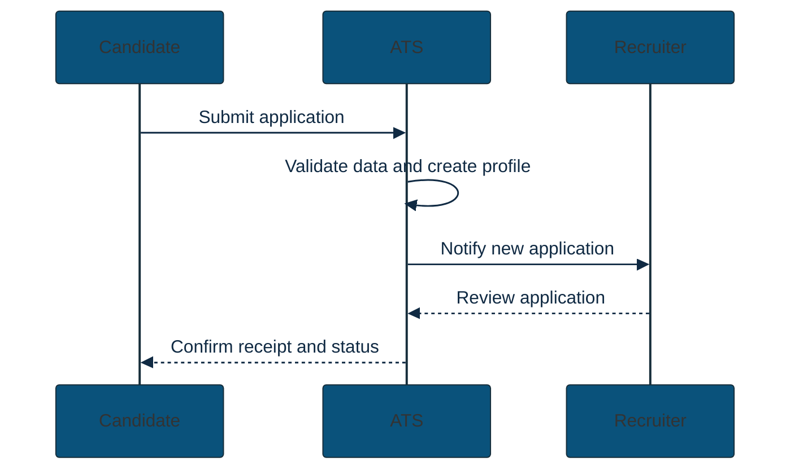
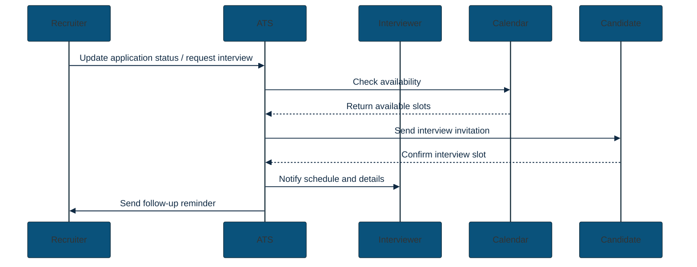
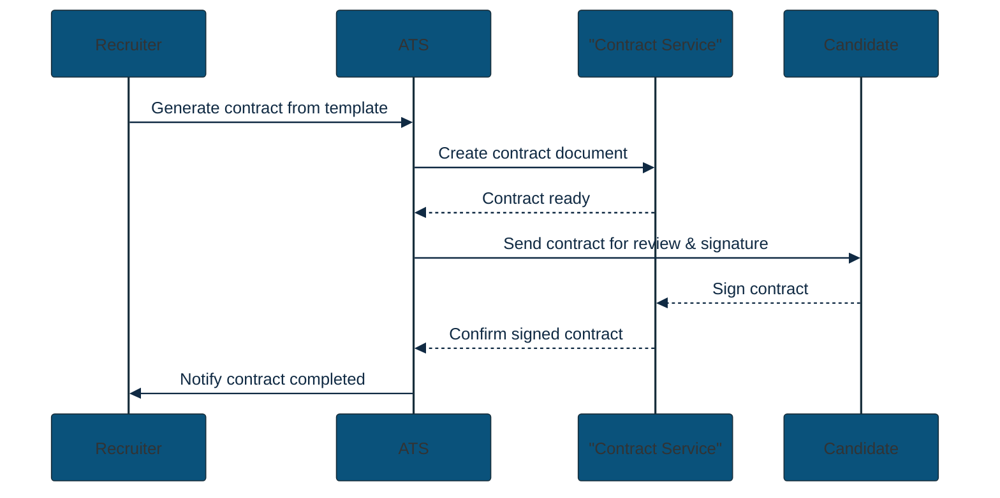
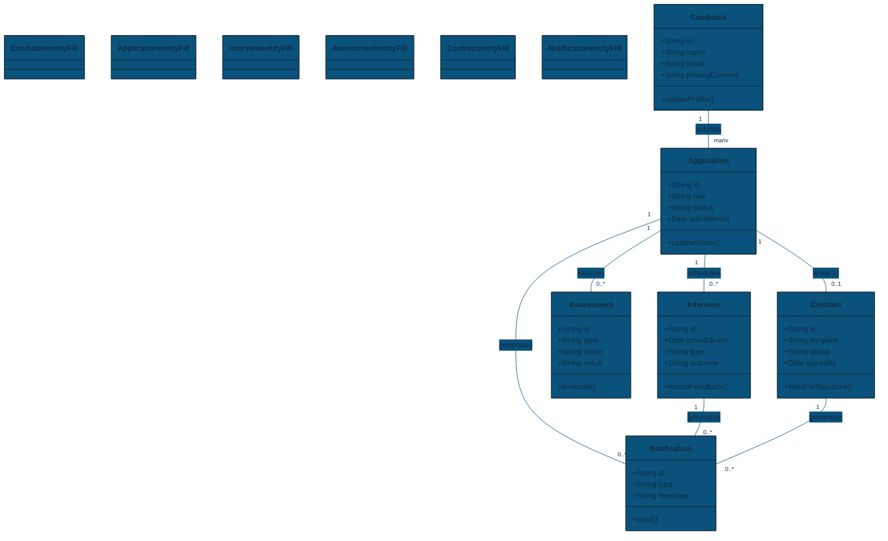
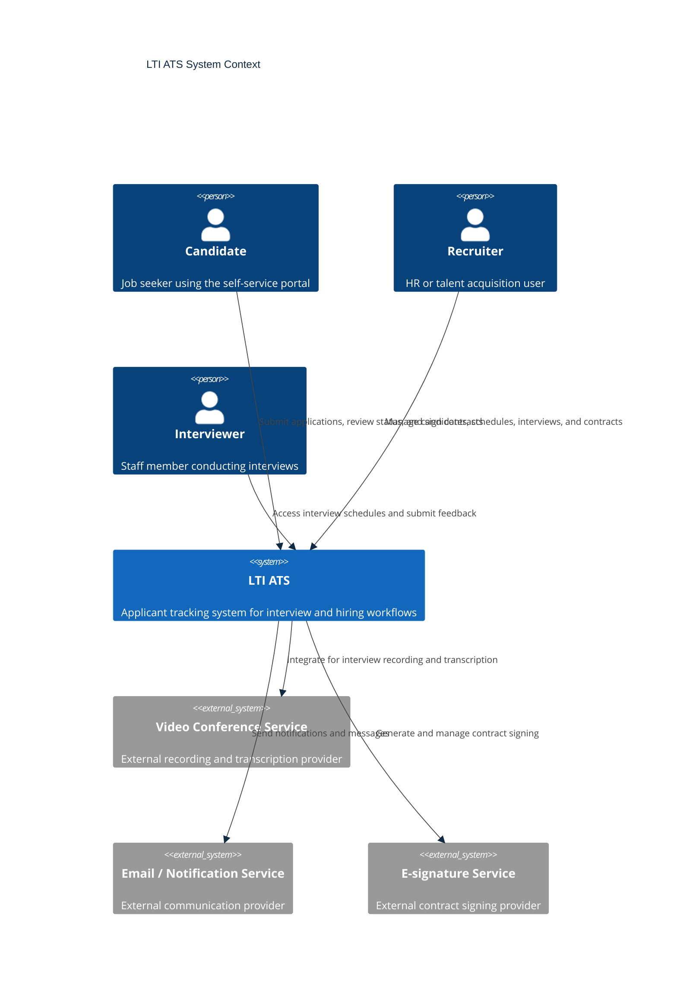
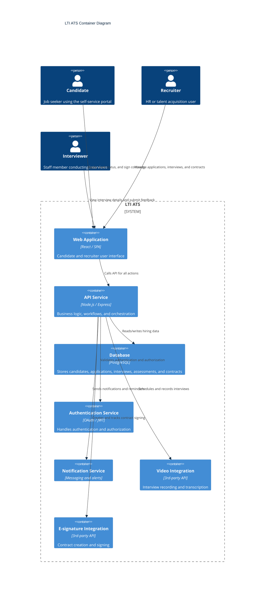
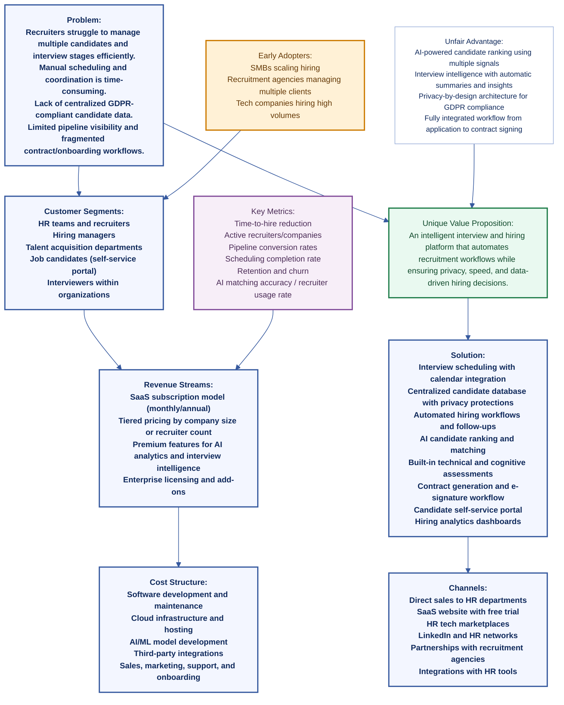

# LTI
## CONTEXT
A software application for an ATS (Applicant Tracking System) focused on interview management, candidate lifecycle tracking, and hiring workflow automation.

## PROPOSED SOLUTION
A responsive web application that helps recruiters and hiring teams manage candidate interviews, assessments, data privacy, follow-up actions, contract workflow, and communication.

## MAIN FEATURES
- Interview scheduling and management
- Candidate database with strong privacy protections
- Follow-up workflow for candidate progression and status updates
- Notifications for interview reminders, status changes, and next steps
- Support for cognitive and technical assessments
- Contract generation and signing workflow
- Candidate self-service portal for profile updates and application tracking

## APPLICATION ENHANCEMENTS
- Candidate self-service portal for applicants to update profiles, upload documents, and track application status.
- Automated follow-up workflows with reminders, next-step suggestions, and task assignments for hiring managers.
- Contract automation with templates, electronic signatures, and approval routing to speed up job offer acceptance.
- Reporting dashboards for pipeline health, time-to-hire metrics, and hiring team performance.

## INNOVATIVE FEATURES
- AI-powered candidate matching and ranking based on skills, experience, assessment results, and role fit.
- Interview intelligence with recording, transcription, summary generation, competency highlights, and sentiment insights.
- Smart scheduling integration with calendars (Google, Outlook) and automatic availability matching.
- Built-in assessment platform with instant scoring, role benchmarks, and candidate comparison tools.
- Privacy-by-design features such as consent tracking, GDPR-ready data handling, and anonymized shortlists.
- Mobile-first experience with recruiter dashboards and candidate-facing mobile access.

## USE CASES
### Create Application
Recruiters or candidates can submit a new job application and track its progress inside the ATS.

### Follow Up Application
Hiring staff manage application progression, schedule interviews, and record next-step actions with automated reminders.

### Sign Contract
The ATS supports contract generation, review, electronic signature, and completion tracking.

### Core Domain Model
The system is structured around core entities that represent candidates, applications, interview events, assessments, contracts, and notifications.

## TECHNOLOGY, INTEGRATIONS, AND ARCHITECTURE
- Responsive web app compatible with desktop, tablet, and mobile devices
- Integration with video conferencing tools for interview recording and transcription
- Integration with email and notification systems for candidate and recruiter communication
- Calendar integration for interview scheduling and availability management
- Electronic signature support for contract approval and signing

The LTI ATS is composed of a user-facing web application, backend services, external integrations, and shared persistence to support hiring workflows end to end.

## LEAN CANVAS
### Problem
- Recruiters struggle to manage multiple candidates and interview stages efficiently.
- Manual scheduling and coordination between candidates and interviewers is time-consuming.
- Lack of centralized candidate data with privacy compliance (e.g., GDPR).
- Limited visibility into pipeline progress and hiring performance metrics.
- Contract generation and onboarding processes are often fragmented across tools.

### Customer Segments
- Primary customers: HR teams and recruiters, hiring managers, talent acquisition departments
- Secondary users: job candidates (through the self-service portal), interviewers within organizations
- Early adopters: small–medium companies scaling hiring, recruitment agencies managing multiple clients, tech companies hiring high volumes of candidates

### Unique Value Proposition
“An intelligent interview and hiring platform that automates recruitment workflows while ensuring privacy, speed, and data-driven hiring decisions.”

Key differentiators:
- AI candidate matching and ranking
- Integrated interview intelligence (recording, transcription, summaries)
- Privacy-by-design candidate database
- Smart scheduling and automated hiring workflows

### Solution
- Interview scheduling with calendar integration
- Centralized candidate database with privacy protections
- Automated hiring workflows and follow-ups
- AI candidate ranking and matching
- Built-in technical and cognitive assessments
- Contract generation and e-signature workflow
- Candidate self-service portal
- Hiring analytics dashboards

### Channels
- Direct sales to HR departments
- SaaS website with free trial
- HR tech marketplaces
- LinkedIn and professional HR networks
- Partnerships with recruitment agencies
- Integrations with existing HR tools

### Revenue Streams
- SaaS subscription model (monthly/annual)
- Tiered pricing by company size or number of recruiters
- Premium features (AI analytics, interview intelligence)
- Enterprise licensing
- Add-ons for advanced reporting or assessments

### Cost Structure
- Software development and maintenance
- Cloud infrastructure and hosting
- AI/ML model development
- Third-party integrations (video, e-signature, calendars)
- Sales, marketing, customer support, and onboarding

### Key Metrics
- Time-to-hire reduction
- Number of active recruiters or companies
- Candidate pipeline conversion rates
- Interview scheduling completion rate
- Customer retention and churn
- AI matching accuracy / recruiter usage rate

### Unfair Advantage
- AI-powered candidate ranking using multiple signals (skills, assessments, experience)
- Interview intelligence with automatic summaries and insights
- Privacy-by-design architecture for GDPR compliance
- Fully integrated workflow from application → interview → contract signing

